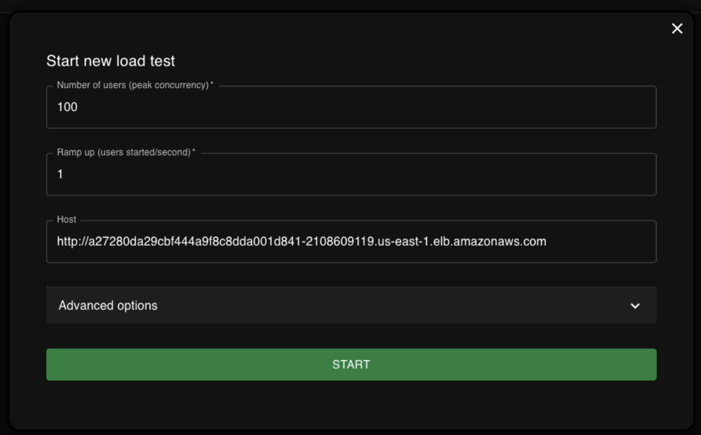
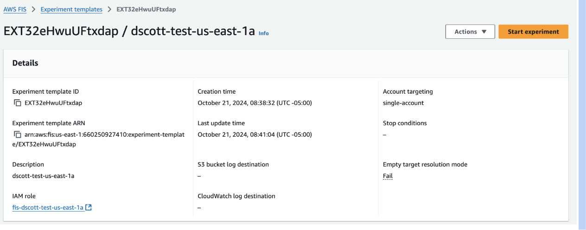
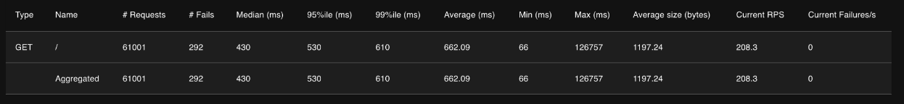

# Summary

Users may choose to simulate AWS availability zone faults for the purposes of testing their configurations and 
resiliency of their applications running on AWS.  This is a guide to summarize the steps it takes to 
accomplish this task as it relates to the Red Hat OpenShift Service on AWS (ROSA) service.


## Resiliency Best Practices

Before stepping through the steps for testing regional high availability across availability zones, it is 
important to understand configuration options that may affect availability.

This is not an all encompassing list, as there are far too many variables in each configuration to consider, but 
is meant to be a good starting point to generalize availability.


### Pod Anti-Affinity

Pod anti-affinity is a practice that ensures that similar pods running similar applications are not scheduled on 
the same node.  Scheduling pods on the same node puts the application at risk in the case that the node that is 
running the pods were to experience an outage.  Pod anti-affinity can prevent this situation.

> **EXAMPLE:** https://docs.openshift.com/container-platform/4.14/nodes/scheduling/nodes-scheduler-pod-affinity.html#nodes-scheduler-pod-affinity-example-antiaffinity_nodes-scheduler-pod-affinity


### Pod Topology Constraints

This concept is generally an afterthought and automatically set by default Kubernetes scheduler parameters in public 
cloud environments, but it is important to understand.  This ensures that, beyond running on the same nodes, like 
pods do not run in similar topologies, such as a datacenter or availability zone, in case the entire environment would 
disappear.  In public cloud environments, the scheduler is availability zone aware, based on availability zone node 
labels, and distributes pods accordingly.  This should be used in conjunction with anti affinity rules to ensure 
proper placement.

> **EXAMPLE:** https://docs.openshift.com/container-platform/4.14/nodes/scheduling/nodes-scheduler-pod-topology-spread-constraints.html#nodes-scheduler-pod-topology-spread-constraints-examples_nodes-scheduler-pod-topology-spread-constraints


### Pod Disruption Budget

A pod disruption budget ensures minimal availability of an application, preventing things like upgrades from 
taking down an application.

> **EXAMPLE:** https://docs.openshift.com/container-platform/4.14/nodes/pods/nodes-pods-configuring.html#nodes-pods-pod-distruption-about_nodes-pods-configuring


### Cluster Autoscaler

Cluster autoscaler allows automation to increase available cluster capacity when capacity is exhausted.  This 
helps in situations where resource utilization spikes and suddenly requires more capacity.  It is important to 
note that cluster autoscaler is reactive as opposed to being proactive.  This means that the cluster autoscaler 
controller must wait until pods reach a “Pending” state before it can scale the cluster.  This also means that pod 
resource requests must be set to tell the scheduler when capacity is reach.

Also important to note is that capacity scaling takes several minutes to complete.  This is because nodes must be 
provisioned and join the cluster.

> **EXAMPLE:** https://docs.openshift.com/rosa/rosa_cluster_admin/rosa-cluster-autoscaling.html


### Health Checks

One of the most important concepts in a Kubernetes-based application platform is automation.  Understanding 
how you monitor and react when an application is down can help increase its overall availability.  In OpenShift, we 
use a Kubernetes concept called “probes” to probe the application for its availability, and automate things such as 
restarting when the application is determined to be unavailable.

> **EXAMPLE:** https://docs.openshift.com/container-platform/4.14/applications/application-health.html


### Availability Zone Specific Services

Some services, such as Elastic Block Store (EBS) are tied to a specific availability zone.  If the application 
state is stored in an EBS volume, and the availability zone were to fail, the state would not be accessible from the 
volume until the AZ is restored.  In this case, there should be something that would replicate state across 
availability zones, or an acceptance of the AZ limitation for the application.


## Walkthrough

> **WARNING:** this walkthrough uses Amazon Fault Injection Service to simulate an availability zone outage.  This 
> will forcefully terminate OpenShift nodes represented by EC2 instances.  **If there is any state or data stored on 
> these instances that are created/used by your applications, it will be lost**.  Be sure that you are not storing 
> local state on the instances before running through this procedure.

* ROSA is a managed service offering.  This means that Red Hat SRE is continuously monitoring the platform.  When 
performing disruptive actions like this, you must put the cluster into `Limited Support` mode so that SRE is not 
alerted on cluster failures.  To do this, simply login to https://access.redhat.com/ and open a support case as 
normal.  Be sure to include your cluster ID in the support case.  You can find your cluster ID with the 
following command:

    ```bash
    rosa describe cluster -c <CLUSTER_NAME> -o json | jq -r '.id'
    ```


* Create your FIS experiment to simulate faults that you wish to inject.  A good walkthrough of similar faults 
to create is located at https://aws.amazon.com/blogs/architecture/simulating-kubernetes-workload-az-failures-with-aws-fault-injection-simulator/.  Feel free to use this 
repository to creates your FIS experiment via automation.

    > **WARN:** if using automation to create experiment, please review carefully before starting to ensure you
    > understand the resources that will be affected by the experiment.

    * ROSA specifically uses a couple of tags that you **may** be able to use to filter resources for:
        
       * `red-hat-managed` = `true`
       * `api.openshift.com/name` = `<CLUSTER_NAME>` (for EC2 and EBS volumes)
    
    * A sample FIS experiment using this repo is located at https://github.com/scottd018/terraform-aws-az-fault-simulation/blob/main/test/main.tf.  
       
       * Please use `git::https://github.com/scottd018/terraform-aws-az-fault-simulation.git?ref=main` as the `source` input.


* If you do not have an app to test and merely want to test resiliency of the platform across AZ failures, you 
may wish install a generic test application.  To do so:

    ```bash
    git clone https://github.com/aws-containers/eks-app-mesh-polyglot-demo.git
    helm install workshop eks-app-mesh-polyglot-demo/workshop/helm-chart/
    ```


* Install the [Locust](https://docs.locust.io/en/stable/installation.html) application on your local workstation. 
Locust is used for generating traffic against a web endpoint and recording metrics such as latency, number of requests, 
and failures.  We can use it in conjunction with running your experiment so we can see how the service behaves 
during a simulated fault.  For full installation instructions, see https://docs.locust.io/en/stable/installation.html.  
Otherwise, a quick install looks as follows:

    ```bash
    pip3 install virtualenv
    virtualenv venv
    source venv/bin/activate
    pip3 install locust
    ```


* Create a `Locustfile` at `locustfile.py` to define how Locust will interact with your application.  A simple
Locustfile example looks as follows (use only the `/` path from your configured endpoint):

    ```python
    from locust import HttpUser, task

    class HelloWorldUser(HttpUser):
        @task
        def hello_world(self):
            self.client.get("/")
    ```


* Run the `locust` command.  Please note that this command must be run from the same directory in which the `locustfile.py`
file was created.


* Determine which hostname your tested app resides at.  If using the sample application from above, you can retrieve 
the endpoint with the following command:

    ```bash
    oc -n workshop get svc frontend -o json | jq -r '.status.loadBalancer.ingress[0].hostname'
    ```


* Once you have Locust running and you have it configured and have determined your endpoint, you can make a local 
web browser connection to the Locust interface by navigating in your web browser to `http://0.0.0.0:8089`.  Be sure
and input your host endpoint into the `Host` field before clicking the `Start` button.  This will begin 
generating web requests against your application:

    


* Once Locust is running, you can start the FIS experiment in AWS by selecting `Start Experiment`:

    


* Monitor the response metrics in Locust:

    


* To correct any failures, please refer to [Resiliency Best Practices](#resiliency-best-practices) above.


* Close the support case from the first step above and have your cluster removed from `Limited Support`.  Be sure 
to explicitly ask support via a case comment to have this done and check that status of Limited Support in 
https://console.redhat.com prior to closing the case.
